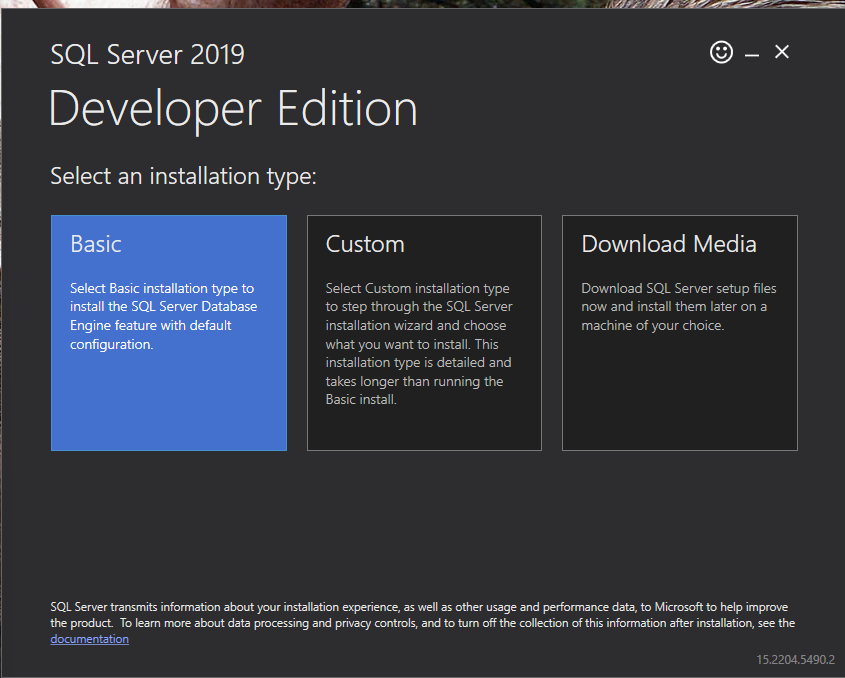
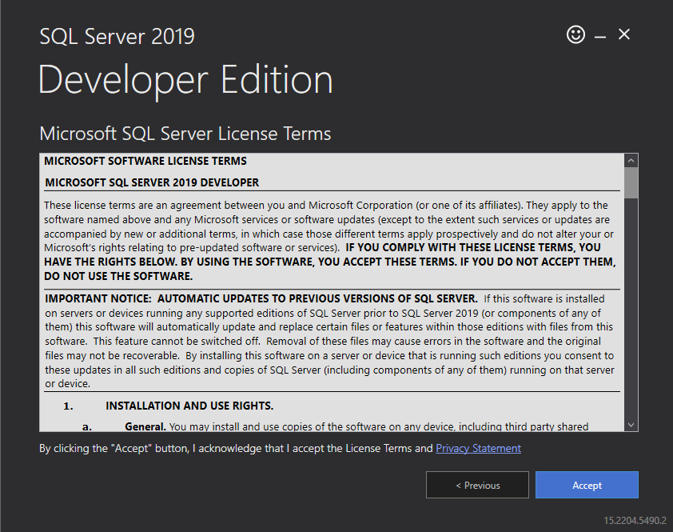
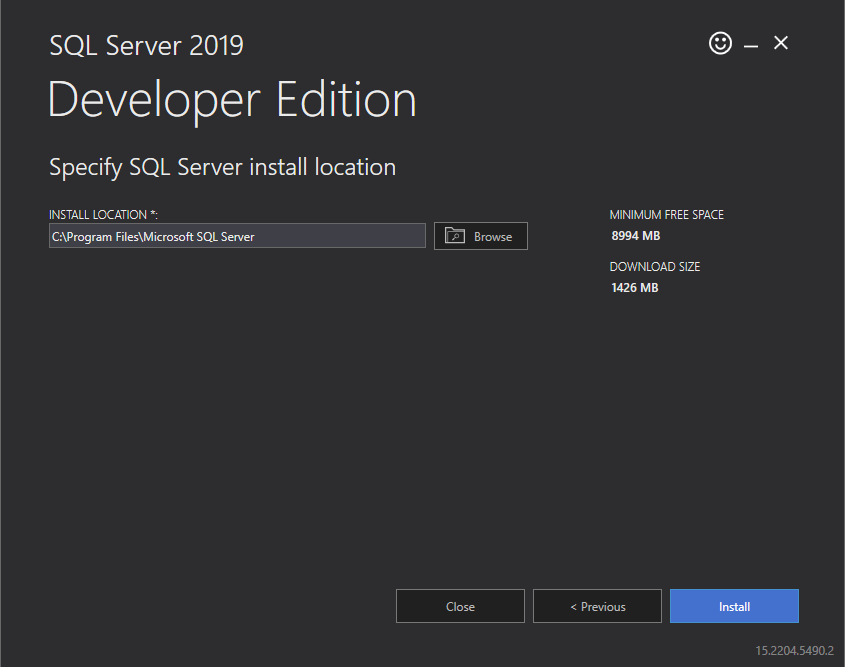
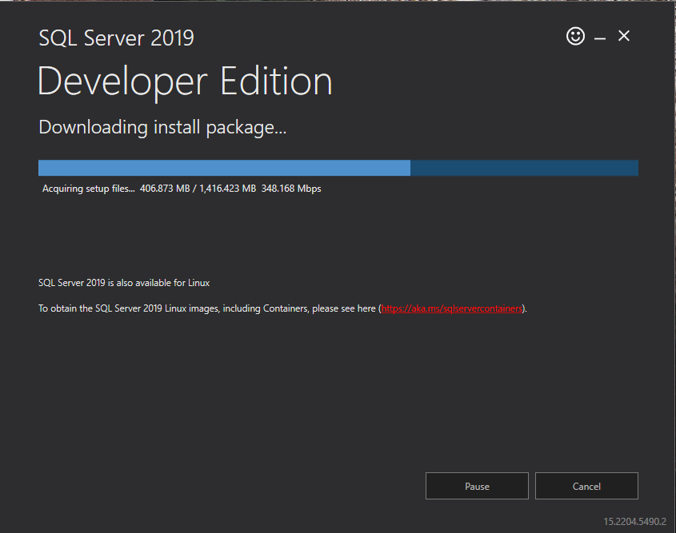
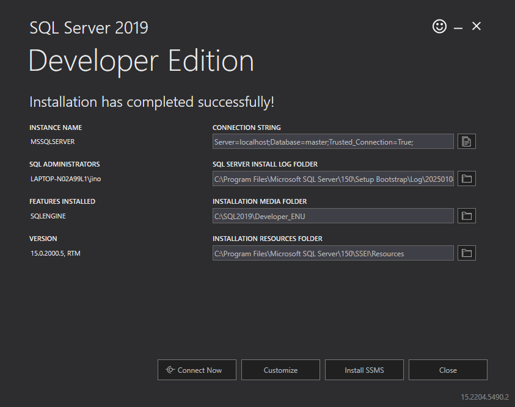
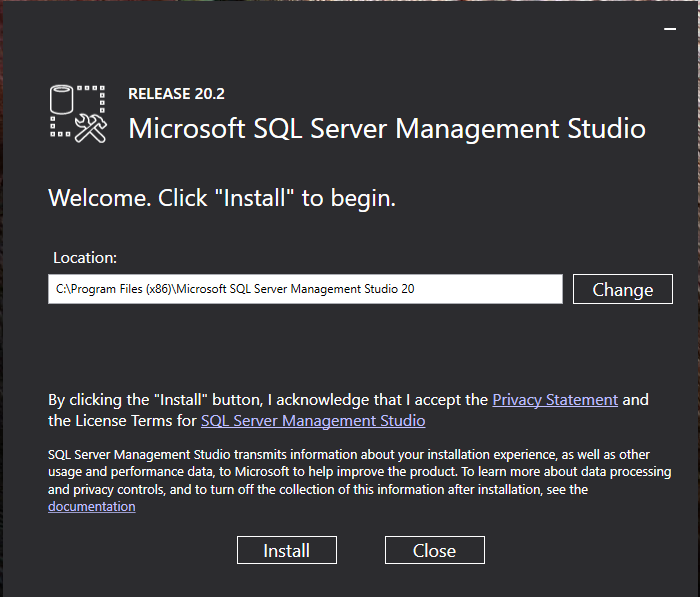
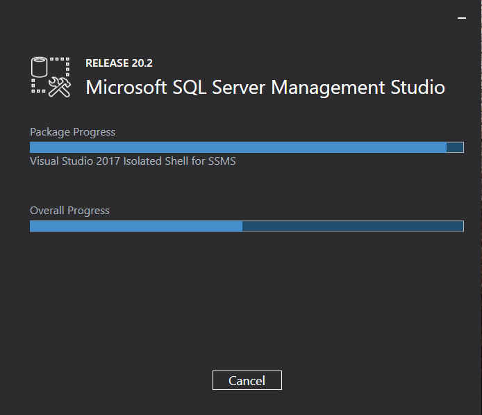
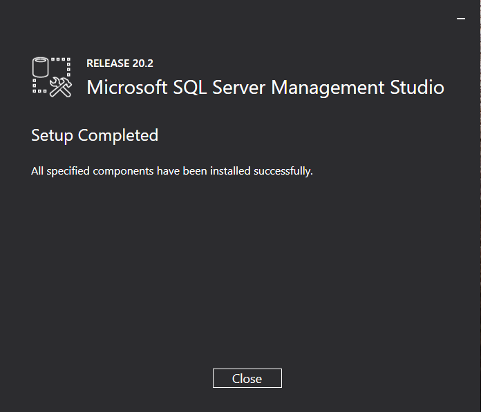

# SQL Server 2019 Developer Edition

[Download Link](https://go.microsoft.com/fwlink/?linkid=866662)

1. Choose "Basic" as the installation type


2. Accept License Terms


3. Select installation location, then click on "Install"


4. Installation Progress


5. Insallation Completion


---

# SQL Server Management Studio 20.2

[Download Link](https://aka.ms/ssmsfullsetup)

1. Click on "Install"


2. Installation Progress


3. Installation Completion



---

# Initial SSMS Setup (enable sa login)

1. Run "PowerShell" or "Command Prompt"
2. type in "sqlcmd" then press enter/return
3. Run the following in sequence: (hit enter/return after every end of the line)
```
1> USE [master]
2> GO
```

```
1> ALTER LOGIN [sa] WITH PASSWORD=N'benilde'
2> GO
```

```
1> ALTER LOGIN [sa] ENABLE
2> GO
```

```
1> exit
```

---

# 