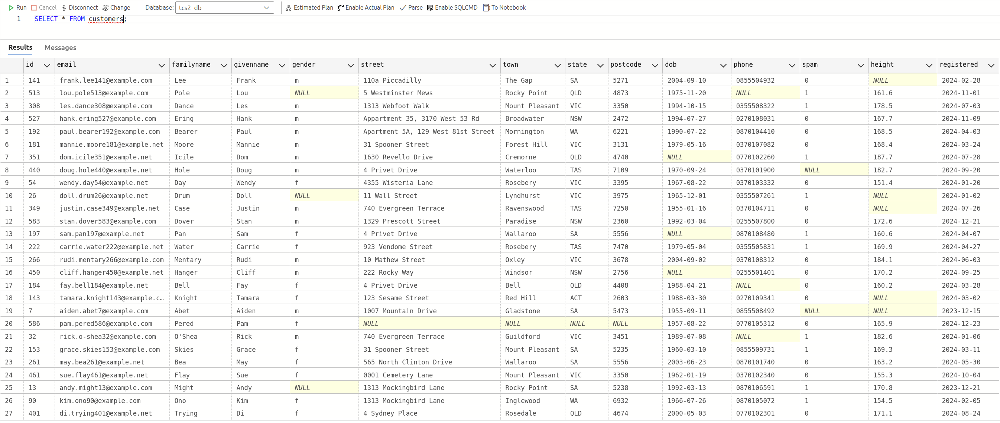
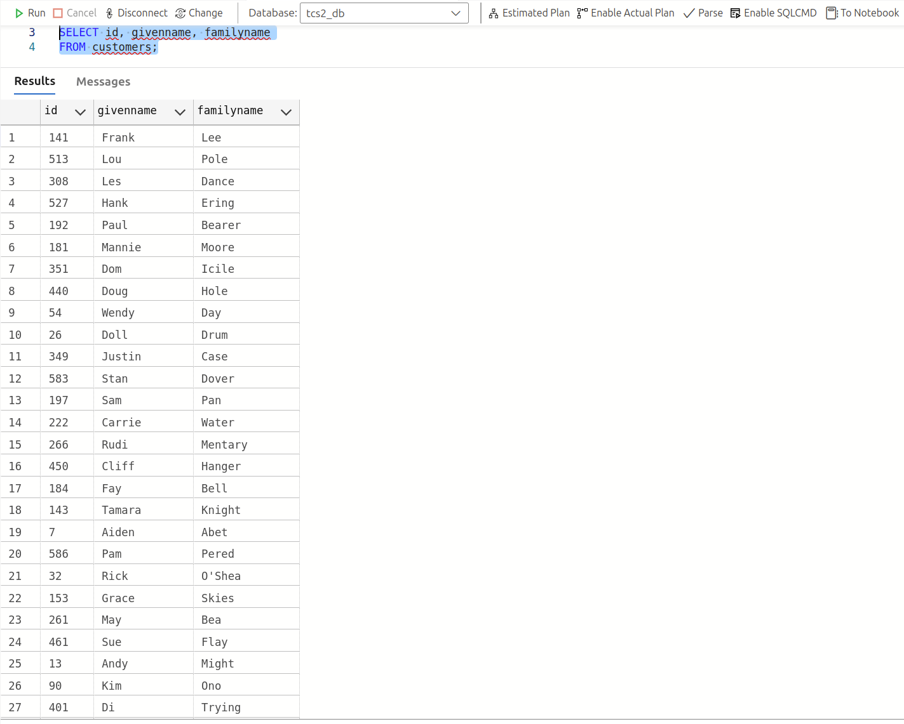
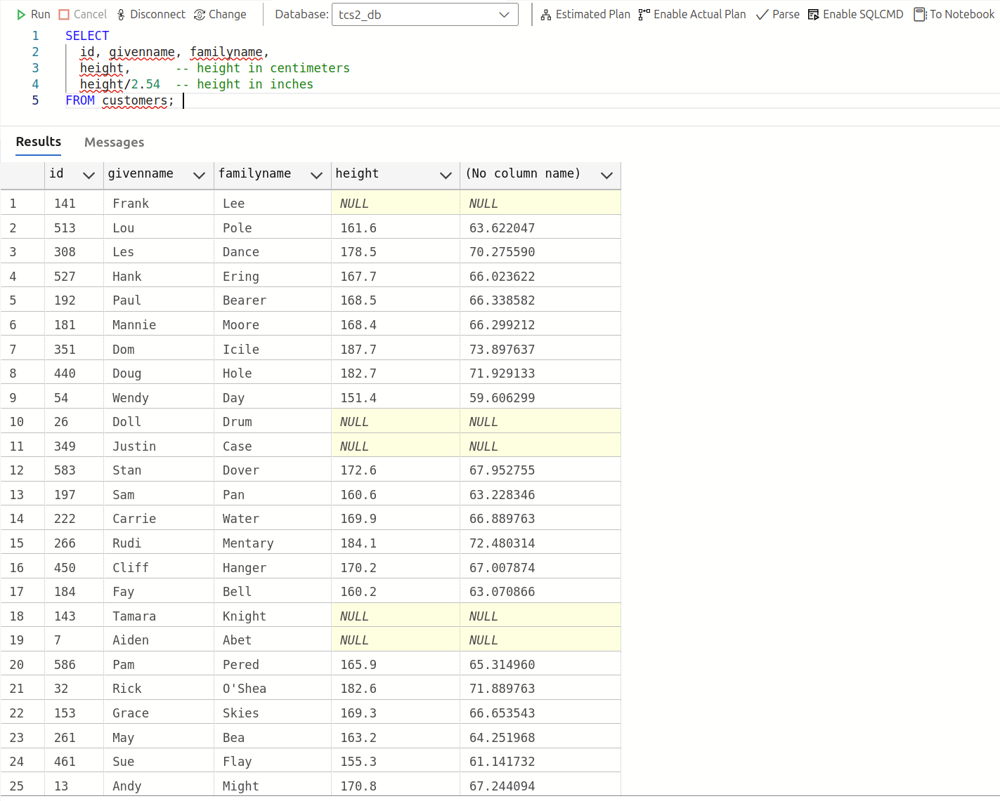
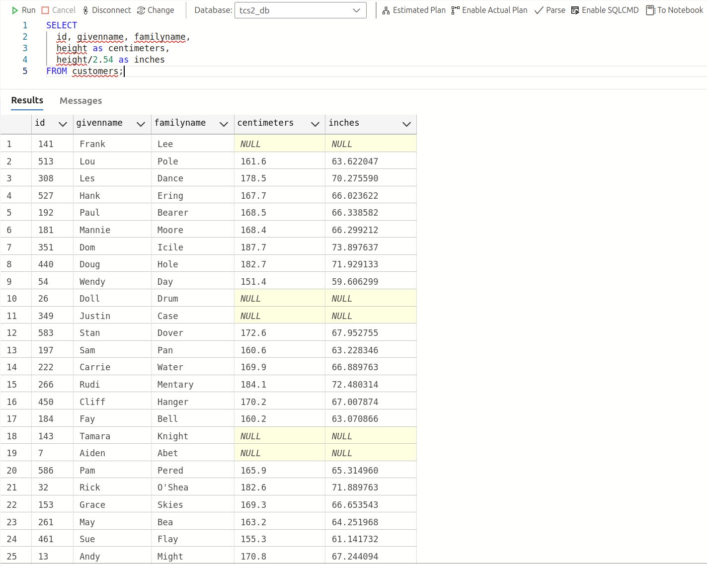
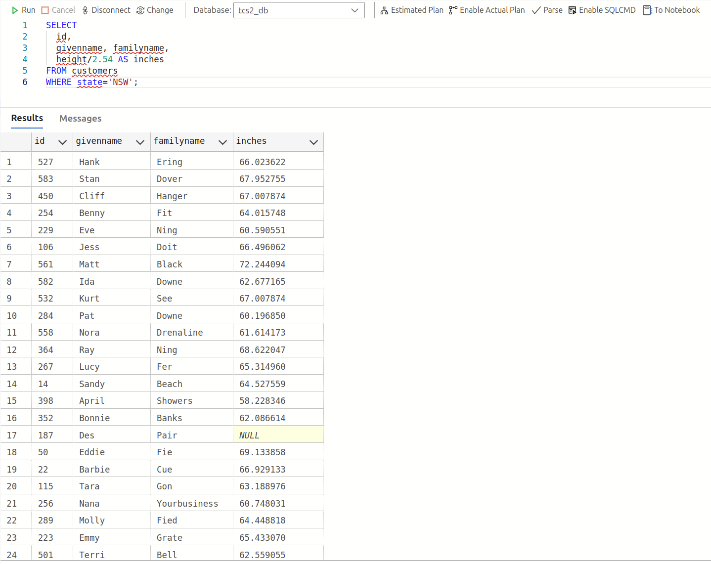
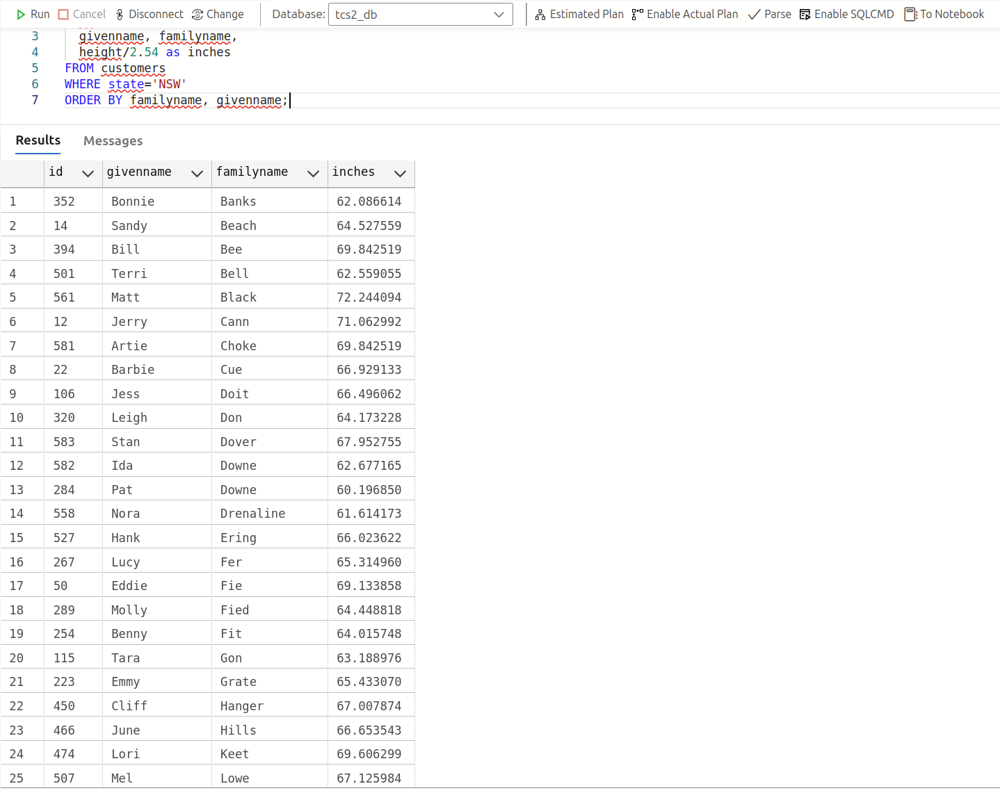
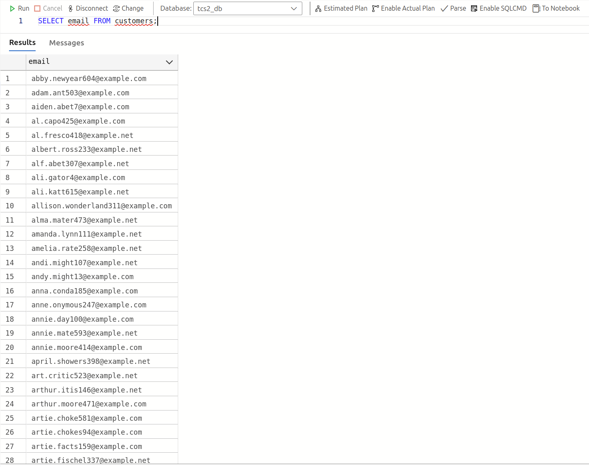
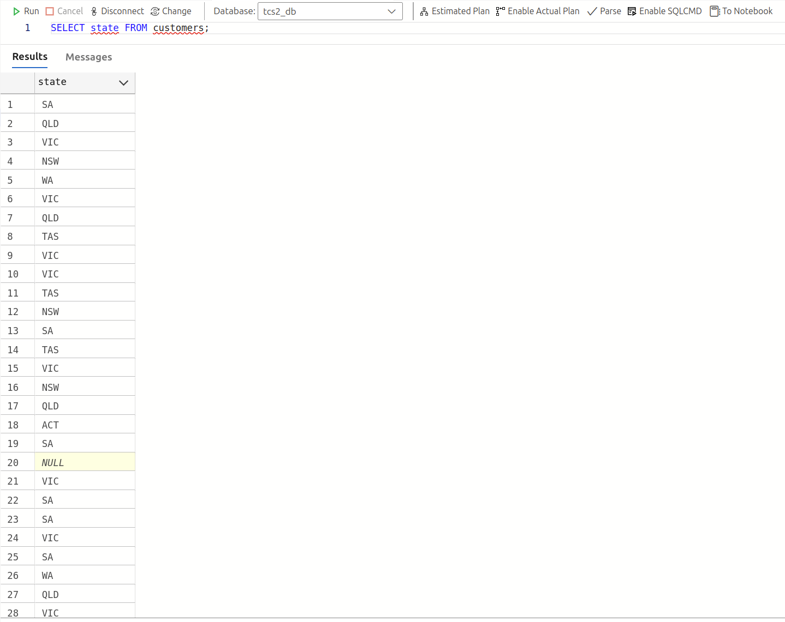
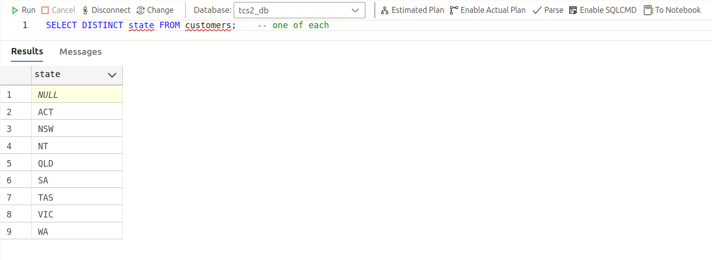
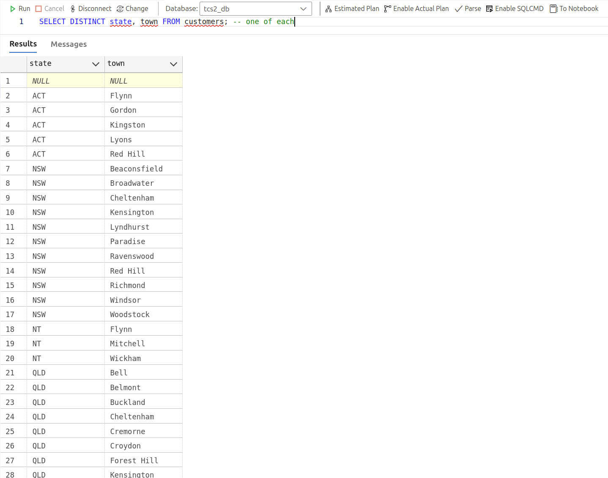

<!-- @import "[TOC]" {cmd="toc" depthFrom=1 depthTo=6 orderedList=false} -->

<!-- code_chunk_output -->

- [Starting With SQL](#starting-with-sql)
  - [Basic `SELECT` Statement](#basic-select-statement)
    - [Case Sensitivity](#case-sensitivity)
    - [Spacing](#spacing)
    - [Clause Ordering](#clause-ordering)
    - [The Semicolon (`;`)](#the-semicolon-)
  - [Selecting Specific Columns](#selecting-specific-columns)
    - [Column Order](#column-order)
    - [Layout](#layout)
    - [Using `SELECT *`](#using-select-)
    - [Calculated Columns](#calculated-columns)
    - [Aliases](#aliases)
  - [Comments](#comments)
    - [Block Comments](#block-comments)
    - [Uses of Comments](#uses-of-comments)
  - [Filtering Rows](#filtering-rows)
    - [Clause Ordering](#clause-ordering-1)
    - [Placing the Semicolon](#placing-the-semicolon)
  - [Ordering the Results](#ordering-the-results)
    - [Clause Order](#clause-order)
  - [Distinct Rows](#distinct-rows)

<!-- /code_chunk_output -->


# Starting With SQL

## Basic `SELECT` Statement

To read data from a table, you use the `SELECT` keyword:

```
SELECT * FROM customers;
```



> [!IMPORTANT]
> This is called a `SELECT` **statement** and will fetch all the rows from the `customers` table.
> Statements usually comprise of two or more **clauses**. In this example, they are the `SELECT` clause
> and the `FROM` clause

> [!NOTE]
> - [x] `SELECT` doesn't mean *display*, although the database client (SSMS / ADS) doesn't know what else to do with the results. Other software might simply fetch the data to be further processed
> - [x] The `*` doesn't mean all *rows*. It is a shorthand for all *columns* of the table.
> - [x] Most of what we'll be doing will involve a `SELECT` statement

### Case Sensitivity

The SQL language is case-insensitive, meaning you can type the same statement in upper or lower case (or jejemon case)

> `select * from customers;`
> `SeLEcT * fROm CUsTomeRS;`

> [!NOTE]
> - [x] It is traditional to use UPPER CASE for keywords (`SELECT` and `FROM`) to highlight them, but it's not so important when you have color highlighting
> - [x] It is also traditional that table and column names be entered in lower case, but most DBMS's don't really care

### Spacing

Although a simple statement might easily fit on one line, you can add as many line breaks and extra spaces or tabs as you like:

```
SELECT
    *
FROM customers;
```
> [!TIP]
> The most important thing is to keep your code readable and to use spacing to help in managing the statement.


### Clause Ordering

The original proposed name for SQL was SEQUEL, Structured *English* Query Language. The idea was that the syntax would resemble the English language.
This has led to a syntax quirk. For example, if you say:

```
Get the Milk
From the Refrigerator
```

you *first* go to the refrigerator and *then* get the milk. That is, `From` is processed before `Get`.

Similarly, in the `SELECT` statement, the `FROM` clause is processed *before* the `SELECT` clause.

However, you cannot write the statement that way:

- [x] You must write `SELECT ... FROM ... ;`
- [x] It means `FROM ... SELECT ... ;`


### The Semicolon (`;`)

The SQL standard requires a semicolon `;` at the end of each statement. You can break up the statement over many lines, but the semicolon then marks the eventual end of the statement.

- [x] Most DBMSs will allow you to ignore the semicolon if there is a single statement. However, you will at least need a semicolon between multiple statements.

- [x] Microsoft SQL will also allow you to omit semicolons for multiple statements, unless you have them on one line, but even [Microsoft doesn't think that's a good idea](https://learn.microsoft.com/en-us/sql/t-sql/language-elements/transact-sql-syntax-conventions-transact-sql?view=sql-server-ver16&tabs=code#transact-sql-syntax-conventions-transact-sql)

> [!TIP]
> It is recommended that you *always* use semicolons, even for a single statement or for Microsoft SQL. This way you make sure that your code is less prone to errors
---

## Selecting Specific Columns

The star character `*` is a shorthand for selecting all columns from the table. You can specify one or more columns instead:

```
SELECT id, givenname, familyname
FROM customers;
```



This selects three columns; it still selects all rows.
The column list is separated by commas:

- [x] The columns do not have to be in the original order.
- [x] You can skip any columns you like.
- [x] Note that in this case the `givenname` and `familyname` order is reversed and that the `email` column is omitted.
- [x] The space after the comma is optional: include it if you think it makes it more readable.
- [x] The comma is a separator: *don't* put a column after the last column, as SQL will expect another column.

> [!WARNING]
> This is a common mistake

```
SELECT id, givenname, familyname, -- extra comma
FROM customers;
```

> It's a good idea to always specify the columns, even if it's all of them.

### Column Order

The default column order, which you see with `SELECT *`, is defined when the table is created. You may not be able to change it, even if you have permission.

> [!NOTE]
> In SQL, there is no correct column order, and there is no performance difference if you select in a different order. That is, there is no *preferred* column order, so you choose the order which best suits your needs, either for presentation or to feed into another application.

### Layout

With a growing column list, it makes sense to lay the columns out more creatively:

```
SELECT
  id,
  givenname, familyname
FROM customers;
```

tThe actual spacing is insignificant, so the preceding example uses spacing to make the statement more readable.

- [x] The column list is vertical rather than inline.
- [x] The column list is indented from the `SELECT` command to show that they are part of the same clause
- [x] `givenname` and `familyname` are on the same line to show that conceptually they are related to each other

### Using `SELECT *`

It is considered bad practice to use `SELECT *` in real life, even if you really want all of the columns; always specify all of the columns. This is because:

- [x] You get no control over the column order of the results
- [x] A change in the underlying table structure might lead to different results next time 

### Calculated Columns

The selected columns don't have to be the original columns. They can be *derived* from one or more columns. Among other things, this means that the table never needs to keep variations on a value since it can always be recalculated when the time comes.

```
SELECT
  id, givenname, familyname,
  height,      -- height in centimeters
  height/2.54  -- height in inches
FROM customers; 
```



In the customers table, height is measured in centimeters. For those who prefer an empirical measurement, you can convert to inches by dividing by 2.54

> [!TIP]
> It would have been a mistake to design a table with both centimeters and inches. Tables should never have a column which is basically the same as another in disguise. As you see, you can always recalculate the other value.

### Aliases

When experimenting with a `SELECT` statement, you can leave calculations as they are, but you will notice that the result will have a missing or dummy name.

When taking your `SELECT` statement seriously, you will need to give calculated columns a distinct name:

```
SELECT
  id, givenname, familyname,
  height as centimeters,
  height/2.54 as inches
FROM customers;
```



## Comments

In an elaborate script, it is useful to include comments about what is going on. A **comment** is any text which will be ignored by SQL, but is meant for humans to read.

The standard comment is text following the `--` characters, until the end of the line:

```
SELECT
  id, givenname, familyname,
  height/2.54 as inches    -- 1in = 2.54cm
FROM customers;
```

The preceding comment is to explain *why* we are dividing by 2.54.
Strictly speaking, the `--` must be followed by a space. However, most, but not all, DBMSs will allow a tab instead of a space, and some, but not all, DBMSs don't require spacing character:

```
-- This is a standard comment (space)
--  This uses a tab, and will probably work, but not necessarily (tab)
--This may also work
```

### Block Comments

*Most* DBMSs also support an unofficial block comment:

`/* block comment */`

This style is also known as the C-style comment because of its use in the C programming language.

The block comment begins with the `/*` combination and ends with the reverse `*/` combination. It can span multiple lines or take up just part of a line.

```
/* This is an introductory SELECT statement
  The rest of this lecrue will go into more detail */
  SELECT
    id,
    /* name: */ givenname, familyname
  FROM customers;
```

> [!TIP] Normally, you should avoid non-standard SQL features, since you never know what the future holds. However, this one is so widely supported that you can regard it as simply a missing feature supplied unofficially.

### Uses of Comments

Since SQL completely ignores comment text, you can write anything you like, even if it amounts to gibberish. However, the following are common uses of comments:

- [x] Explain something which is not obvious code
- [x] Act as section headers in complex scripts
- [x] Temporarily disable some code

```
/* SQL Sampler
================================================
This is an introductory SELECT statement
The rest of the book will go into more detail
================================================ */
SELECT
  id,
  -- email,
  givenname, familyname,
  height/2.54 as inches -- 2.54 cm = 1 inch
FROM customers;
```

In the preceding example, the `email` column is disabled, the `inches` column is explained, and the whole script is preceded by a header comment block. The actual query is also indented for good measure.

> [!NOTE]
> Normally, if you want to disable code, you simply delete it. Using a comment instead is called commenting the code out. The reasons why you would comment code out include:
> - [x] Testing or troubleshooting
> - [x] Leaving it there as an option, subject to further consultation
> - [x] Using it as an alternative to other code

> [!TIP] As regards explanatory code, don't overcomment. Only explain what isn't obvious. Saying too much is like the boy who cried wolf. As a rule, others will simply tune out.

## Filtering Rows

Often, you don't want all rows of a table, but only some of them. The `WHERE` clause is used to decide which rows to select:

```
SELECT
  id,
  givenname, familyname,
  height/2.54 AS inches
FROM customers
WHERE state='NSW';
```



The expression `state='NSW'` is called an **assertion** and is either `true` or `false`. The `WHERE` clause selects only those rows where the assertion is `true`.

Note the single quotes `' ... '` around the `NSW`. In SQL, text values are called **strings** and are enclosed in single quotes. Don't use double quotes `" ... "` because most DBMSs will interpret double quotes differently. Also, note that the string is in UPPER CASE, which matches the data in the customers table. In some DBMSs, you can also use lower case, but not in others.

### Clause Ordering

The `WHERE` clause is evaluated after `FROM`, but before `SELECT`:

```
SELECT ...
FROM ...
-- SELECT processed here!
WHERE ... ;
```

In plain English, this is read as:

1. Start with the table.
2. Filter some rows.
3. Select some columns.

### Placing the Semicolon

When developing your code, it is easy to make the following mistake:

```
SELECT *
FROM customers;
WHERE state='NSW' -- oops
```

This is because you have correctly ended the previous version with a semicolon and simply added a new clause after it. While you are developing your code, it may be helpful to put the semicolon on a separate line:

```
SELECT *
FROM customers;
WHERE state='NSW'
;
```

> [!TIP] This makes it easier to add the additional clauses as you go. You can always tidy up the semicolon when you have finished everything.

## Ordering the Results

Mathematically speaking, a table is a **set** of rows. Among other things, this means that row order is insignificant.

Some DBMSs will output the results in the same order they were added. Some DBMSs will output them in a seemingly random order, depending on how the data is managed internally.

The SQL standard makes a point of not telling a DBMS how to do its job, and the only guarantee is that row order is *not* guaranteed, that is, unless you force the issue.

The `ORDER BY` clause puts the results in a specified order:

```
SELECT
  id,
  givenname, familyname,
  height/2.54 as inches
FROM customers
WHERE state='NSW'
ORDER BY familyname, givenname;
```



In this example, you order the results by `familyname` and, in the event of a tie, by the `givenname`.

> [!IMPORTANT] You can order by one or more columns, in ascending or descending order.
Strictly speaking, the result is no longer a set, as a set is unordered. In some cases, you won't be able to do any more processing once the `ORDER BY` clause is used.

### Clause Order

The `ORDER BY` is both written and evaluated last:

```
SELECT ...
FROM ...
WHERE ...
-- SELECT processed here
ORDER BY ... ;
```

In plain English, this is read as:

1. Start with the table.
2. Filter some rows.
3. Select some columns.
4. Finally, sort the results.

## Distinct Rows

Sometimes, you will need to interpret what somebody asks for. For example, if you want a list of email addresses, the following would do the job:

```
SELECT email FROM customers;
```



On the other hand, if you want a list of states, the following is probably not what you want:

```
SELECT state FROM customers;
```



You will, of course, get a list of all of the state values (as well as a few NULLs which represent missing values). However, you probably don't want the duplicates. If you want one of each, you will need to use `DISTINCT`:

```
SELECT DISTINCT state FROM customers;    -- one of each
```



Using `DISTINCT` treats each value not as an individual value but as a group. You can say that you now have the state groups

> [!CAUTION] Note that one of the groups is `NULL`, meaning that you also have some missing states.

The `DISTINCT` operator acts only on what is in the `SELECT` clause. If you add the `town` column as well:

```
SELECT DISTINCT state, town FROM customers; -- one of each
```



Here, you will get distinct *combinations* of state and town. In the result set, it's not the `state` which is distinct nor the `town`, it's the combination. We can say that we now have state/town groups.

> [!NOTE] Again, you will see the `NULL` as a separate group. In this set of data, there is no state without a town and vice versa, which is why there’s only one group with `NULLs`.

---