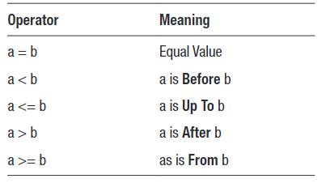

- [Week 04 - Filtering Data](#week-04---filtering-data)
  - [I. The `WHERE` clause](#i-the-where-clause)
    - [A. Unrelated Assertions](#a-unrelated-assertions)
    - [B. All and Nothing](#b-all-and-nothing)
  - [II. Dealing with `NULL`](#ii-dealing-with-null)
    - [A. Deliberately Ignoring NULLs](#a-deliberately-ignoring-nulls)
    - [B. Finding NULLs](#b-finding-nulls)
  - [III. Numbers](#iii-numbers)
    - [A. Discrete vs Continuous Values](#a-discrete-vs-continuous-values)
  - [IV. Strings](#iv-strings)
    - [A. Quotes](#a-quotes)
    - [B. Case Sensitivity](#b-case-sensitivity)
    - [C. Trailing Spaces](#c-trailing-spaces)
    - [D. Filtering with String Functions](#d-filtering-with-string-functions)
    - [E. Handling Quotes and Apostrophes](#e-handling-quotes-and-apostrophes)
    - [F. Before and After Strings](#f-before-and-after-strings)
  - [V. Dates](#v-dates)
    - [A. Dates are not Strings](#a-dates-are-not-strings)
    - [B. Alternative Date Formats](#b-alternative-date-formats)
    - [C. Date Comparisons](#c-date-comparisons)
    - [D. Filtering with a Date Calculation](#d-filtering-with-a-date-calculation)
  - [VI. Multiple Assertions](#vi-multiple-assertions)
    - [A. `AND` and `OR`](#a-and-and-or)
    - [B. The `IN` Operator](#b-the-in-operator)

---

# Week 04 - Filtering Data

## I. The `WHERE` clause

The `WHERE` clause is used to limit the results to certain criteria. For example, if you want to limit customers to shorter customers, you can use:

```
SELECT *
FROM customers
WHERE height < 170;
```

The `WHERE` clause is followed by an **assertion** - a test which is either `true` or `false`. In this case, the test is `height < 170`, and only the rows where this is true are returned.

For simple comparisons like this, you use the classic operators.

You can reverse the assertion by using the `NOT` operator:

```
SELECT *
FROM customers
WHERE NOT height < 170;
```

> This will return only those rows where the height is *not* less than 170.

In many cases, the `NOT` has an alternative expression:

```
SELECT *
FROM customers
WHERE height >= 170;
```

You may also test for exact matches:

```
SELECT *
FROM customers
WHERE height = 170;
```

and non-matches

```
SELECT *
FROM customers
WHERE height <> 170;
```

OR

```
SELECT *
FROM customers
WHERE NOT height = 170;
```

### A. Unrelated Assertions

The assertion in the `WHERE` clause doesn't have to involve any columns in the table at all. For example, these are acceptable:

```
SELECT *
FROM customers
WHERE 1 = 1;  -- all rows
```

OR

```
SELECT *
FROM customers
WHERE 1 = 0;  -- no rows
```

 The assertion 1 = 1 is obviously true for all rows, so all rows are returned. The assertion 1 = 0 is never true, so no rows are returned.

### B. All and Nothing

The result of a `WHERE` clause is always valid, even if it's not what you're looking for. For example:

```
SELECT * FROM customers WHERE id > 0;  -- All rows
SELECT * FROM customers WHERE id < 0;  -- Nothing
```

An assertion may result in all rows. That may be a trivial assertion, but it doesn't make it meaningless: next time, it may be different.

An assertion may result in no rows at all. Again, next time it may be different. It is not an *error* to ask for something which isn't there; it may be an error if you then go on and presume more results.

> [!NOTE]
> There is no technical reason why the `id` must be positive. That's just a very common convention.

---

## II. Dealing with `NULL`

The `WHERE` clause returns rows where an assertion is true. If an assertion is not true, it's not necessarily **false**. The other option is that it's unknown.

If you count the results from the preceding examples, you will find that the number of customers where height is less than 170, plus the number of customers where it isn't, is less than the total number of customers. This is because some of the customers don't have a height value recorded.

In SQL, NULL represents a missing value. For your convenience, and possible confusion, it is usually displayed with the word `NULL`, often with a different color or background color. However, in reality there is nothing at all.

There are a number of reasons why a value might be missing:

- The information is not applicable, such as a date of death when the person hasn't died yet.

- The information is not available, such as a date of birth which was not supplied; you can't argue that the person hasn't been born.

- The information is regarded as irrelevant, such as additional delivery instructions.

- None of the preceding reasons, but we just don't care, so it hasn't been entered.

> [!NOTE]
> Unfortunately, SQL doesn't distinguish between the different reasons, so you will need to be careful when interpreting how to deal with missing values; technically, all you can say about `NULL` is that the data is missing, though sometimes you can infer something from the context.

For example, a missing date of death doesn't of itself mean that a person hasn't died. You would need more data to be sure.

Sometimes, people will refer to a "NULL value," but this is a contradiction in terms. This is important, because `NULL` is always skipped when values are involved. That is why the rows where `height < 170` combined with rows where `NOT height < 170` do not give the total number of rows: both assertions only test for values, never for NULLs. In this case, we will simply use NULL as a noun; some prefer the expression **"NULL marker."**

```
SELECT *
FROM customers
WHERE NULL = NULL;
```

> [!IMPORTANT]
> There will be no results since comparing `NULL` is always false.

### A. Deliberately Ignoring NULLs

Why would SQL even allow comparing NULLs when `NULL=NULL` is always false? More realistically, you might compare two columns, both of which might happen to contain 
`NULLs`. For example:

```
SELECT *
FROM artists
WHERE born = died;
```

Nobody who dies in the year they were born ever became a famous artist so any matches would indicate an error. However, a match would only make sense when both values exist and are the same.

Here, you definitely want to ignore NULLs for the comparison.

### B. Finding NULLs

How, then, do you find missing values? SQL has a special expression `IS NULL` to find NULLs:

```
SELECT *
FROM customers
WHERE height IS NULL;  -- missing height
```

You can also find all the existing heights:

```
SELECT *
FROM customers
WHERE height IS NOT NULL;  -- existing heights
```

In the first example, `IS NULL` selects for missing values. In the second, `IS NOT NULL` selects for values which exist. You will find that the number of results for the second example is the same as adding up the results for `height < 170` and `NOT height < 170`.

You can verify that if you combine the results of those queries:

```
SELECT * FROM customers WHERE height < 170
UNION
SELECT * FROM customers WHERE NOT height < 170;
```

> [!IMPORTANT]
> The `UNION` clause combines the results from two or more `SELECT` statements, as long as the columns match.

---

## III. Numbers

In the preceding example, the height is a number, so comparisons are simple. Numbers follow the so-called **Goldilocks Trichotomy**: when comparing numbers, the second is too low, too high, or just right.


> [!NOTE] 
> `NOT a < b` is not the same as `a > b`, as you have to allow for the equals case.

### A. Discrete vs Continuous Values

Compare these two statements

```
SELECT *
FROM artists
WHERE born >= 1700;
```

```
SELECT *
FROM artists
WHERE born > 1699;
```

They will, of course, give you the same result set, since 1700 comes immediately after 1699.

However, that's not always true:

```
SELECT *
FROM customers
WHERE height >= 170;
```

```
SELECT *
FROM customers
WHERE height >= 169;
```

This will probably give a very different result, since 170cm doesn't immediately come after 169cm. Unlike the year of birth, height in centimeters can involve fractional parts.

We say that values for the year of birth are **discrete**: there are whole values, but no between values. On the other hand, values for the height are **continuous**: there are between values.

> [!CAUTION]
> Whenever you have discrete values, you have a choice between the first two examples earlier, since one discrete value is definitely before the next. With continuous values, however, you don’t have this choice.

---

## IV. Strings

The most basic string filter is to look for exact matches:

```
SELECT *
FROM customers
WHERE state = 'VIC';
```

To get the customers living elsewhere:

```
SELECT *
FROM customers
WHERE state <> 'VIC';  -- WHERE NOT state = 'VIC'
```

As with all filters, filtering for non-existent values is not an error:

```
SELECT *
FROM customers
WHERE state = 'XYZ';
```

However, it *may* be an error if your data types don't match:

```
SELECT *
FROM customers
WHERE state = 23;
```

> [!TIP]
> In SQL Server, the number is implicitly converted to a string for comparison purposes.

### A. Quotes

In SQL, strings are enclosed in single quotes. Double quotes have a completely different meaning.

What happens if you use double quotes instead of single quotes?

```
SELECT *
FROM customers
WHERE state = "VIC";
```

With most DBMSs, you will get an error message to the effect that the column `VIC` is unknown. That is, the double quotes are interpreted as **enclosing a colum name**, ant not a string. SQL imagines that you are trying to match the `state` column with the unknown `VIC` column.

```
-- single quotes:
SELECT * FROM customers WHERE familyname = 'Town';

-- double quotes:
SELECT * FROM customers WHERE familyname = "Town";
```

The first example looks for customers where `familyname` matches `Town`, while the second looks for customers whose family name happens to be the same as the town where they live.

Which means that in SQL Server, you may use double quotes around any column:

```
SELECT *
FROM customers
WHERE "state" = 'VIC';
```

### B. Case Sensitivity

How strings compare isn't always the same. For example, the `customers` table has all states in uppercase. If you try to match lower case:

```
SELECT *
FROM customers
WHERE state = 'vic';
```

You will get the same result set as if it was in uppercase.

> [!IMPORTANT]
> How variations of strings compare is called **collation**. In other languages, there can be many variations, but in English, the main variation is upper/lower case.


> [!TIP]
> The default collation for PostgreSQL, Oracle and SQLite is case sensitive; that is, uppercase and lowercase are treated as different. 

### C. Trailing Spaces


If you add a space to the *end* of a search string:

```
SELECT *
FROM customers
WHERE state = 'VIC ';  -- additional space at the end
```

you *may* get the some results, depending on the DBMS:

- MySQL / MariaDB / MSSQL will trim the trailing space, so you will get all matches for `VIC`
- PostgreSQL, SQLite, and Oracle will *not* trim the space, so there will be no matches.

> [!IMPORTANT]
> If on the other hand, you put the extra space at the beginning:
> ```
> SELECT *
> FROM customers
> WHERE state = ' VIC';  -- additional space at the beginning
> ```
> you would not be getting any matches!

### D. Filtering with String Functions

You may use any function you like in the `WHERE` clause. For example, to select for shorter family names, you could use the `len()` function:

```
SELECT *
FROM customers
WHERE len(familyname) < 5;
```

You may also select function results as part of the `SELECT` clause:

```
SELECT *, len(familyname)
FROM customers
WHERE len(familyname) < 5;
```

### E. Handling Quotes and Apostrophes

It is possible that your string data contain single quotes, especially when used as apostrophes. For example, a family name of `O'shea`, or the town to be `s-Gravenhage` (the formal name of The Hague). If you try to enter them in a normal single-quoted string, you will receive an error:

```
SELECT *
FROM customers
WHERE familyname = 'O'Shea' OR town = ''s-Gravenhage';
```

> [!IMPORTANT]
> The single quote in the string will prematurely end the string, which makes a mess of the rest of the statement.

If you need to include single quotes, you need to enter the single quote *twice* (which is not the same as a double-quote):

```
SELECT *
FROM customers
WHERE familyname = 'O''Shea' OR town = '''s-Gravenhage';
```

### F. Before and After Strings

The other comparison operators also work with strings, but you should think of them in terms of their position in alphabetical order:


For example, to select names before the letter "K"

```
SELECT *
FROM customers
WHERE familyname < 'K';
```

---

## V. Dates

Dates look simple enough, but can lead to confusion and difficulty. To begin with, the term "date" may or may not include time.

Broadly speaking, time is a point in history, measured from some arbitrary beginning in the past. For convenience, time is grouped into seconds, minutes, hours, and days. What happens after that gets more complicated.

You may find all the customers with a particular date of birth with a statement such as:

```
SELECT *
FROM customers
WHERE dob = '1989-11-09';
```

> [!IMPORTANT]
> As you know, in SQL you enclose strings in single quotes. You *also* enclose dates in single quotes. However, a date is not a string

### A. Dates are not Strings

Even though date literals are written in single quotes, they are not strings. You can see this instantly when you experiment with extra spaces:

```
SELECT *
FROM customers
WHERE dob = ' 1989-11-09';
```

A string match would fail here, but the date still matches. 

### B. Alternative Date Formats

The recommended format is the **ISO 8601** format, which is a standard that describes dates, times, and other related data. For dates, the format is `yyyy-mm-dd`

> [!IMPORTANT]
> The ISO 8601 format also allows you to omit hyphens:
> ```
> SELECT *
> FROM customers
> WHERE dob = '19891109';  -- same as '1989-11-09'
> ```

> [!TIP]
> Whenever possible, refrain from using the slash format: `??/??/yyy`. This is because different countries differ in how to interpret the first two parts.

### C. Date Comparisons

Apart from two dates being the same, you can also make the same sort of comparisons as with numbers. However, it is probably better to reword their meanings:



```
-- Born before 1 Jan 1980
SELECT *
FROM customers
WHERE dob < '1980-01-01';
```

```
-- Born FROM 1 Jan 1980
SELECT *
FROM customers
WHERE dob >= '1980-01-01';
```

> [!NOTE]
> As always, `NULLs` will be omitted from the results: if you don’t know the date of birth, you can’t claim that they were born before or from a particular date.

You can also use `BETWEEN`

```
-- Born in the 1980s
SELECT *
FROM customers
WHERE dob BETWEEN '1980-01-01' AND '1989-12-31';
```

OR if you want to exclude people born in the 80s:

```
-- Non-80s people
SELECT *
FROM customers
WHERE dob NOT BETWEEN '1980-01-01' AND '1989-12-31';
```

> [!NOTE]
> `BETWEEN` is inclusive: the first and last dates of the range are also a match.Also note that in all cases, the `NULL` dates of birth are omitted.


### D. Filtering with a Date Calculation

As with strings, you can use a date calculation to filter the results. For example, to find customers over 40 years old (whose date of birth is before 40 years ago):

```
SELECT *
FROM customers
WHERE dob < dateadd(year, -40, current_timestamp);
```

---

## VI. Multiple Assertions

The `BETWEEN` operation earlier can also be written as:

```
-- Born in the 1980s
SELECT *
FROM customers
WHERE dob BETWEEN '1980-01-01' AND '1989-12-31';
```

There are now two assertions: `dob >= '1980-01-01'` and `dob <= '1989-12-31'` where both assertions must be true

### A. `AND` and `OR`

The `AND` operator is often called a logical operator and uses the rules of mathematical logic.

Using the `AND` operator, you can also implement variations of `BETWEEN`:

```
--  Inclusive Range (same as BETWEEN)
SELECT *
FROM artists
WHERE born >= 1700 AND born <= 1799;  

-- Exclusive Range
SELECT *
FROM artists
WHERE born > 1699 AND born < 1801;  

-- Mixed Range
SELECT *
FROM artists
WHERE born > 1699 AND born <= 1799;
```

The `AND` operator can be used to combine more than two assertions. For example:

```
SELECT *
FROM customers
WHERE state = 'VIC' AND height > 170 AND dob < '1980-01-01';
```

In this case, all of the assertions must be true. Note that here the three assertions are independent of each other, unlike the previous examples where they are testing the same value.

You can also combine assertions with the `OR` operator:

```
SELECT *
FROM customers
WHERE state = 'VIC' OR state = 'QLD';
```

The `OR` operator requires at least one of the assertions to be true.

The logical `OR` is always inclusive: one or more assertions must be true. The only way to fail the OR operation is for everything to be false. In English, "or" is sometimes exclusive (such as "Tea or Coffee"); in logic, this is not the case.

Things get a little complicated once you mix `AND` with `OR`

```
-- Operator Precedence
SELECT *
FROM customers
WHERE state = 'QLD' OR state = 'VIC' AND dob < '1980-01-01';
```

In the logical expression `AssertionA OR AssertionB AND AssertionC`, 
`AND` takes precedence over `OR`. The upshot of this is that the result of the preceding statement is the same as:

```
-- Same as: state = 'QLD' OR state = 'VIC' AND dob < '1980-01-01'
SELECT *
FROM customers
WHERE state = 'QLD' OR (state = 'VIC' AND dob < '1980-01-01');
```

### B. The `IN` Operator

Using `OR`, there is a special case. You might test a single expression for an exact match against different values, such as:

```
SELECT *
FROM customers
WHERE state = 'VIC' OR state = 'QLD' OR state = 'WA';
```

Here, the expression state is tested against various values. You can rewrite the test using the `IN` expression:

```
SELECT *
FROM customers
WHERE state IN ('VIC', 'QLD', 'WA');
```
---