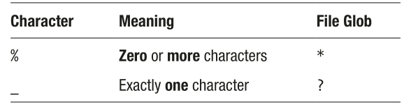

# Week 05 - Filtering Data (continued)

## I. Derived Lists

The `IN` clause also takes on a second form which is more sophisticated.

Suppose, for example, you want to find the biggest spenders, based on single
sales. The problem is that the sales totals are in one table (`sales`), while the customer
details are in another (`customers`). Fortunately, the `sales` table includes the important
`customerid`, which relates back to the `customers` table.

To get the results:

1. From the `sales` table, get the `customerid`s where the `total`
exceeds some value.'

2. From the `customers` table, get the date for customers whose id matches the results of the first step

For the first step:

```
SELECT customerid
  FROM sales
  WHERE total > 1200;
```

For the second step, use the `IN` expression to match customers against the multiple values in the first step:

```
SELECT *
  FROM customers
  WHERE id IN(SELECT customerid FROM sales WHERE total > 1200);
```

The `SELECT` statement in the `IN` clause is called a **subquery**. In principle, it is
evaluated first, and the results are used in the main query.

> [!TIP]
> If you are using `IN` with a subquery, there is an alternative expression which may be
more intuitive:

```
SELECT *
	FROM customers
	WHERE id = ANY(SELECT customerid FROM sales WHERE total > 1200);
```

Similarly, you can use a subquery to find all the paintings by Dutch artists:

1. Find the `id`s of the artists whose nationality is Dutch
2. Find the paintings whose `artistid` is one of the previous `id`s:

```
SELECT *
	FROM paintings
	WHERE artistid IN (SELECT id FROM artists WHERE nationality = 'Dutch');
```

OR

```
SELECT *
	FROM paintings
	WHERE artistid = ANY(SELECT id FROM artists WHERE nationality = 'Dutch');
```

## II. Wildcard Matches

For strings, you can broaden your search using **wildcard matching**. For example:

```
SELECT *
  FROM customers
  WHERE familyname LIKE 'Ring%';
```

The string `Ring%` is no longer a simple string: it is now a **pattern**.
Wildcard matching has two requirements:

- The `LIKE` keyword is used to indicate that what follows is a **pattern**
- The pattern include special characters.

> [!NOTE]
> You can use `LIKE` without special pattern characters, but then the pattern will simply
be an exact match. For example:

```
SELECT *
	FROM customers
	WHERE familyname LIKE 'Ring';

SELECT *
	FROM customers
	WHERE familyname = 'Ring';
```

On the other hand, if you don't use the `LIKE` keyword, pattern character will be simply treated as other ordinary characters:

```
SELECT *
	FROM customers
	WHERE familyname = 'Ring%';  -- nobody has the literal familyname called Ring%
```

### A. Case Sensitivity and Patterns

Remember that some DBMSs and some databases are case sensitive and some are not.
For MySQL/MariaDB and Microsoft SQL Server, which are, by default, case insensitive, you don't need to worry, so you can just as readily use lower case:

```
SELECT *
	FROM customers
	WHERE familyname LIKE 'ring%';
```

or just to be sure:

```
SELECT *
	FROM customers
	WHERE lower(familyname) LIKE 'ring%';
```

### B. Pattern Characters

Standard SQL has two main pattern characters:



The column "File Glob" shows the character you would use on your operating system if you were trying to use pattern matching when looking for files; "glob" is geek speak for pattern matching. You can't use those characters in SQL, but it's there for comparison.

Note that the `%` wildcard matches zero or more characters. This means that there may or may not be additional characters. For example:

```
SELECT *
	FROM customers
	WHERE familyname LIKE 'ring%';
```

This will yield anybody whose family name *starts* with Ring, even if there's no more after that.

The other wildcard character `_` matches exactly one character. It's the sort of match you might use for crosswords. For example:

```
SELECT *
	FROM customers
	WHERE familyname LIKE 'R__e';	   --	Rate, Rise, Rice, Rowe
```

> [!WARNING]
> Watch out for the underscore (`_`) character. For historical reasons, it's a little wider than ordinary characters, so adjacent underscores actually touch. That makes it a little difficult to count if you've got more than, say, two in a row.

When you combine both wildcard characters, you create the sense of at least. For example:

```
--	At least 4 characters, starting with S:
SELECT *
  FROM customers
  WHERE familyname LIKE 'S___%';

--	Begins with Ring
SELECT *
  FROM customers
  WHERE familyname LIKE 'Ring%';

--	Ends with ring
SELECT *
  FROM customers
  WHERE lower(familyname) LIKE '%ring';

--	Contains ring
SELECT *
  FROM customers
  WHERE lower(familyname) LIKE '%ring%';

--	Begins with S and Ends with e
SELECT *
  FROM customers
  WHERE familyname LIKE 'S%e';
```

You'll note that where the position of the match could be anywhere, we used the `lower()` function to be safe. For case-insensitive databases, that's not necessary.

And using the `_` wildcard:

```
--	Wholly Contains s
SELECT *
  FROM customers
  WHERE familyname LIKE '%_s_%';

--	Exactly 4 characters
SELECT *
  FROM customers
  WHERE familyname LIKE '____';

--	Exactly 4 characters, starting with R
SELECT *
  FROM customers
  WHERE familyname LIKE 'R___';

--	At least 4 characters
SELECT *
  FROM customers
  WHERE familyname LIKE '____%';

--	At least 4 characters, starting with S
SELECT *
  FROM customers
  WHERE familyname LIKE 'S___%';
```

### C. Wildcards with Non-strings

Generally, wildcards are meant to be used with strings. However, some DBMSs are more relaxed with using wildcards if the data can be converted to a string.

For example, using a wildcard with numbers:

```
SELECT *
	FROM customers
	WHERE height LIKE '17%';
```

You may also have some success with dates:

```
SELECT *
	FROM customers
	WHERE dob LIKE '19%';
```

### D. Extensions to Wildcards

Most of the time, these two wildcards will do. However, some DBMSs offer extensions which allow you to fine-tune your match.

Many DBMSs offer **Regular Expressions**, which is a very sophisticated pattern matching syntax. Some, such as MSSQL, simply extend the syntax available with the `LIKE` clause

Regular Expressions give you more precise control over matching individual characters.

For example, to find family names which start with the letters A - K, but are not followed by h or y, you would use the pattern `^[A-K][^hy]`

- The first `^` starts at the beginning of the string.
- `[A-K]` matches any character in the *range* from A to K inclusive.
- `[^hy]` does not (`^`) match any of the characters h, y

> [!IMPORTANT]
> Microsoft SQL doesn't natively support Regular Expressions, but it offers a simpler variation. Using the (square) brackets (`[ … ]`) wildcard with the `LIKE` keyword, it takes the following forms:

```
SELECT *
	FROM customers
	WHERE familyname LIKE '[a-k][^hy]%';
```

### E. Simple Pattern Match Example

if you want to find the paintings with the word "portrait" in the title:

```
SELECT *
	FROM paintings
	WHERE title LIKE '%portrait%';
```

If you want to match "self portrait", you will need to allow for the fact that sometimes there's a space and sometimes there's a hyphen. You can do that with the `_` wildcard:

```
SELECT *
	FROM paintings
	WHERE title LIKE '%self_portrait%';
```