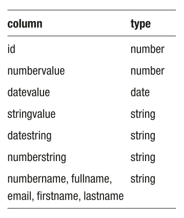
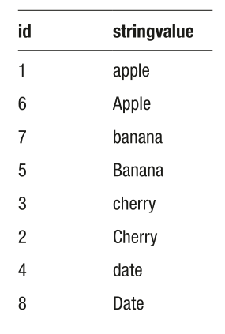
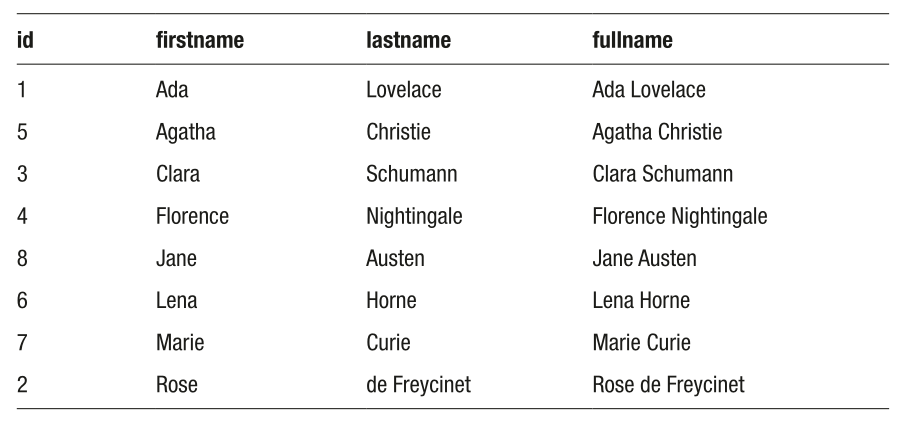
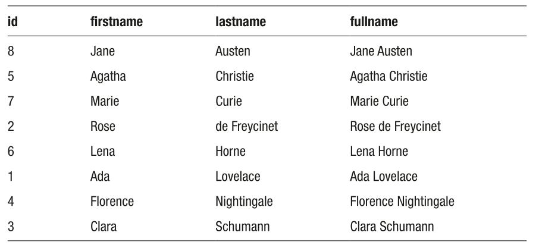
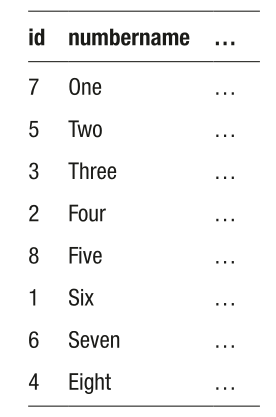

# Week 06 - Ordering Results

A Relational Database is based on a number of mathematical principles, including the notion that a table is a set of rows. Two important properties of mathematical sets are:

- A set has no duplicates
- A set is not ordered

SQL does not specify how data is to be stored, as that is a matter for the DBMS software. Neither does it specify in what order data should be fetched.
But, you do have the option to specify a row order using the `ORDER BY` clause.

> [!NOTE]
> Once you specify a row order, the result is no longer technically a **set**. 

## I. Using the `ORDER BY` Clause

You can order the result set by using `ORDER BY` at the end of the `SELECT` statement:

```
SELECT *
  FROM customers
  ORDER BY id;
```

> [!IMPORTANT]
> The `ORDER BY` is followed by one or more columns to be sorted

> [!NOTE]
> - `ORDER BY` is the *last* main clause in the `SELECT` statement.
> - `ORDER BY` is also evaluated las t

The `ORDER BY` clause is independent of the `SELECT` clause, meaning, you don't have to select the columns you are sorting by:

```
SELECT givenname, familyname
  FROM customers
  ORDER BY id;
```

But of course, it might be more meaningful to include the column in which you want your results to be ordered with:

```
SELECT 
  id,
  givenname, familyname
  FROM customers
ORDER BY id;
```

### Sort Direction

By default, sort order is ascending, that is, increasing. You can make the point by including the `ASC` keyword:

```
SELECT *
  FROM customers
ORDER BY id ASC;
```

> [!TIP]
> Since the default direction is ascending anyway, the `ASC` keyword is redundant.

On the other hand, you can reverse the sort order by appending `DESC` (descending):

```
SELECT *
  FROM customers
ORDER BY id DESC;
```

---

## II. Missing Data (`NULL`)

The SQL standard is vague about how `NULL`s should be treated by `ORDER BY`.
The only requirement is that they should be grouped together, either at the beginning or at the end.

In Microsoft SQL Server, sorting with `NULL` values group them at the beginning.

> [!TIP]
> There is a workaround to "replace" `NULL` values in `SELECT` statements:

```
-- Pseudo NULLS FIRST
SELECT *
  FROM customers
ORDER BY coalesce(height, 0);

-- Pseudo NULLS LAST
SELECT *
  FROM customers
ORDER BY coalesce(height, 1000);
```

The `coalesce()` function replaces `NULL` with an alternative value. 

---

## III. Data Types

In SQL, there are various types of data, but most of the types are variations on three core types:

- **Numbers** measure or count something
- **Dates** Mark a point in time
- **Strings** are any miscellaneous text 

> [!CAUTION]
> In SQL terms, Which comes first? January or February?

The `sorting` table, has examples of different types:

```
SELECT * FROM sorting;
```



- Numbers are, of course, sorted in **numeric** order; negative numbers are lower then positive numbers.
- Dates are sorted in **historical** order, with older dates before newer dates.

The fact that data type influences sort order is one reason why it's important to get the data type correct when designing a database. Sometimes, it is tempting to cheat and store all the data as a string, which will accept any type of value. However, that will make a mess of the sort order.

```
-- sorted as number
SELECT * FROM sorting ORDER BY numbervalue;

-- sorted as string
SELECT * FROM sorti ng ORDER BY numberstring;
```

You will see that the string version is sorted strictly in alphabetical order, from left to right, while the suitably typed version is sorted more appropriately.

If you have a column full of strings which are supposed to be numbers, you can use the `cast` function:

```
SELECT * FROM sorting ORDER BY cast(numberstring as integer);
```

The cast function changes the data type to another. Here, the type is set to `INT`, which is short for `INTEGER`. Once the data has been cast, it will sort accordingly.

You can do the same with dates:

```
-- sorted as date
SELECT * FROM sorting ORDER BY datevalue;

-- sorted as string
SELECT * FROM sorting ORDER BY datestring;

-- sorted as date
SELECT * FROM sorting ORDER BY cast(datestring as date);
```

---

### Case Sensitivity and Collation

If you execute the following SQL statement:

```
SELECT * FROM sorting ORDER BY stringvalue;
```

Your results may vary from DBMS to DBMS



One thing which can affect your results is whether the data is treated as case sensitive or case insensitive, that is, whether or not upper and lower case are regarded as the same. 

How the DBMS regards upper and lower case, as well as accented variations on letters, is called the **collation**.

Broadly speaking, collation refers to how variations on the same letter are treated. This includes whether these variations are treated as the same character and, if not, which comes before which.

The two main variations to be considered are:

- **Case**: Upper and lower case
- **Accents**: Accented variations such as e, é, ê, and è in French

How the data is collated in your table is affected by:

- The default collation of the DBMS
- The assigned collection (if any) of a table or column
- An optional `COLLATE` clause after the `ORDER BY` clause

---

## IV. Multiple Columns

If you attempt to sort by a compound column (one which includes multiple values), you will have a few problems:

```
SELECT id, firstname, lastname, fullname
	FROM sorting
ORDER BY fullname;
```



One of the many problems in combining data is that you can't sort it properly without going through the extra effort of splitting it when the time comes.

To sort the data properly, you need the name split into parts:

```
SELECT id, firstname, lastname, fullname
	FROM sorting
ORDER BY lastname, firstname;
```



> [!TIP]
> What happens if there are also duplicates in the next column? There are two possibilities:
> - If there are more `ORDER BY` columns, then the data is further sorted
> - If there are no more `ORDER BY` columns, *there is no guaranteed order*

### Sort Direction on Multiple Columns

If you are sorting by multiple columns, be aware that each column has its own sort direction. For example:

```
SELECT *
  FROM paintings
ORDER BY price, title DESC;

SELECT *
  FROM paintings
ORDER BY price DESC, title DESC;
```

---

## V. Sorting by Calculated Columns

The ORDER BY clause is followed by one or more columns to be sorted. However, those columns don't need to be the original table columns. You can sort by any calculated value. For example:

```
SELECT id, givenname, familyname
	FROM artists
ORDER BY died - born;
```

As usual, you probably want to list the calculation in the `SELECT` clause, so you can calculate it there and order by the result:

```
SELECT id, givenname, familyname, died-born
	FROM artists
ORDER BY died - born;
```

Best practice is to use an *alias* when using calculated columns:

```
SELECT id, givenname, familyname, died-born AS age
	FROM artists
ORDER BY died - born;
```

Since the `ORDER BY` clause is the only one processed after the `SELECT` clause, you can actually use the alias:

```
SELECT id, givenname, familyname, died-born AS age
	FROM artists
ORDER BY age;
```

---

## VI. Limiting the Number of Results

A practical scenario is to break down result sets in "batches"
For example, to limit the results to the first five:

```
SELECT *
	FROM customers
WHERE dob IS NOT NULL
ORDER BY dob OFFSET 0 ROWS FETCH FIRST 5 ROWS ONLY;
```

> [!IMPORTANT]
> The `WHERE dob IS NOT NULL` clause is added to filter out the missing dates of birth.

This very verbose `OFFSET ... FETCH` clause has two important parts: the `OFFSET` part effectively means skipping the first so many rows, while the `FETCH FIRST` part is the maximum number of rows you want. If there aren’t so many rows, you will get as many as are available.

> [!NOTE]
> - `OFFSET ... FETCH ...` is an extension of the `ORDER BY` clause
> - `FIRST` can be replaced by `NEXT`, which has exactly the same effect
> - `ROWS` can also be written as `ROW`, which also has the same effect

### Paging

One reason you might want to use this is to page results, such as viewing a catalog of 20 items per page:

```
--	First Page
  SELECT * FROM paintings
  ORDER BY title OFFSET 0 ROWS FETCH FIRST 20 ROWS ONLY;

--	Page 4 (skip 3 pages)
  SELECT * FROM paintings
  ORDER BY title OFFSET 3*20 ROWS FETCH FIRST 20 ROWS ONLY;
  SELECT * FROM paintings
  ORDER BY title OFFSET 60 ROWS FETCH FIRST 20 ROWS ONLY;

--	Reverse Order: Last page first
  SELECT * FROM paintings
  ORDER BY title DESC
  OFFSET 0 ROWS FETCH FIRST 20 ROWS ONLY;
```

---

## VII. Fetching a Random Row

If you want to fetch one or more rows at random, as you might if testing your application or sampling data, you can limit the results after a random sort. To get a random sort, you will need one of the randomization functions, which vary across DBMSs:

```
SELECT * FROM customers
ORDER BY newid();
```

---

## VIII. Nonalphabetical String Order

Strings, as noted earlier, are sorted in alphabetical order. The problem is that in the real world, most things are not in alphabetical order: days of the week, colors in the rainbow, elements in the periodic table, and stations on a railway line are all in their own order, and sorting them alphabetically will only annoy people.

SQL has no intrinsic method of sorting strings nonalphabetically. There are multiple workarounds, including a separate table with the values in preferred order. However, you can achieve the same result by creating a string with the values in your preferred order and locating the position of each value within the string.

For example, the sorting table has a column numbername which is a number written as text. Obviously, sorting alphabetically will be of no use at all. To sort by value:

- Create a string with the values in order: 'One,Two,Three,Four,Five,Six,Seven,Eight,Nine'
- Use a function to locate your value within the string

```
SELECT *
	FROM sorting
ORDER BY CHARINDEX(numbername, 'One,Two,Three,Four,Five,Six,Seven,Eight,Nine');
```



---
