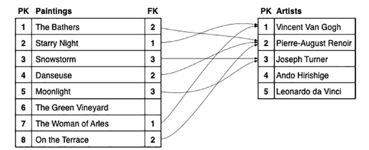
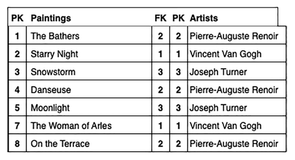
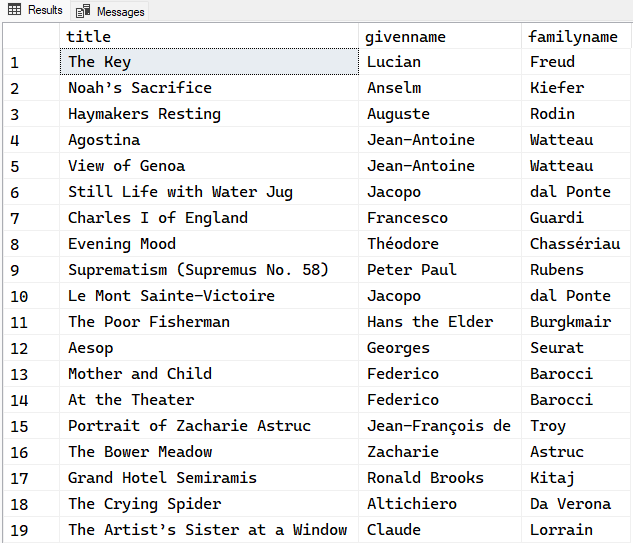
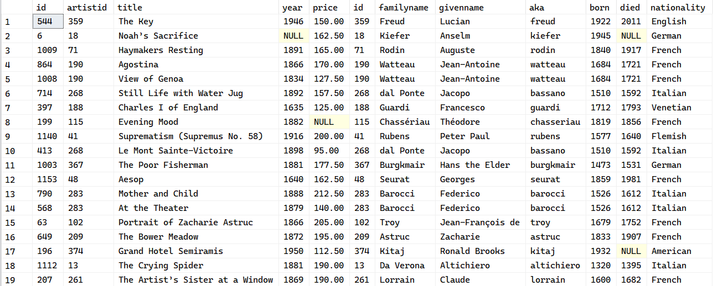
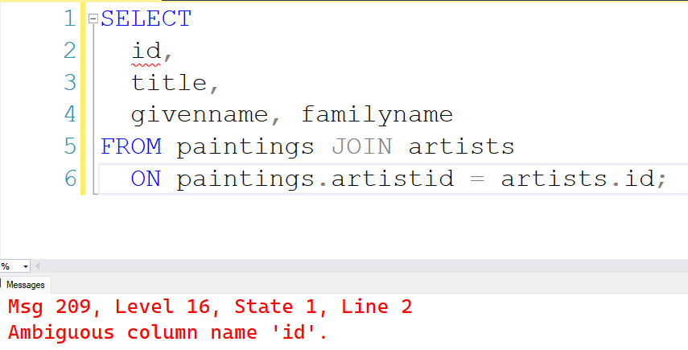
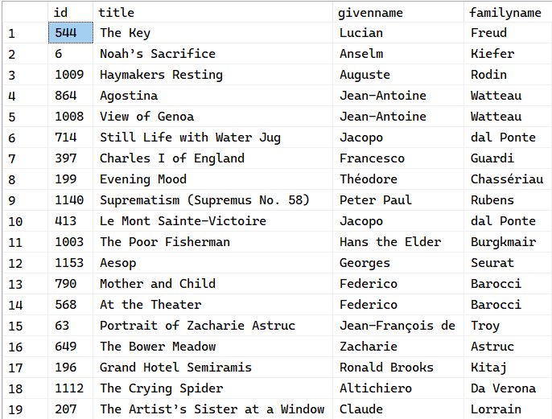
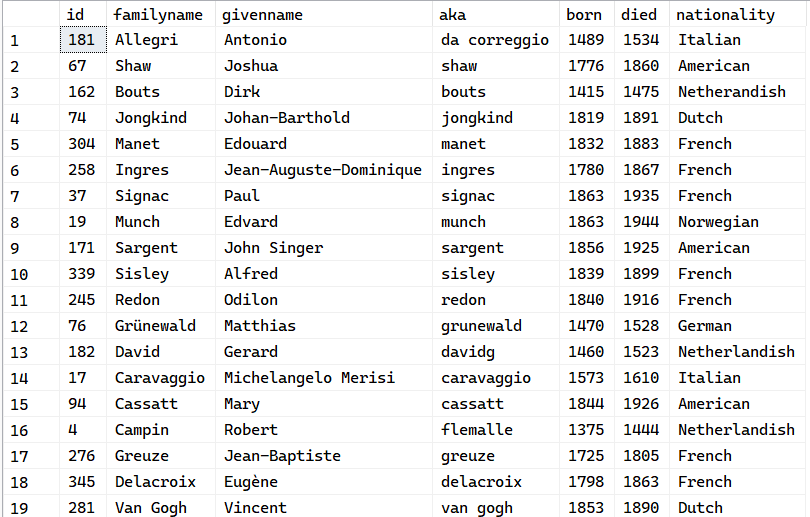
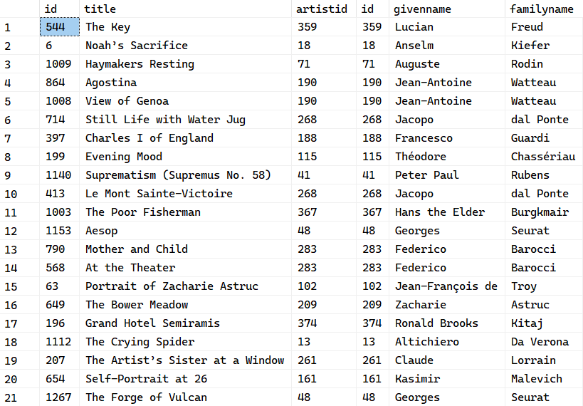
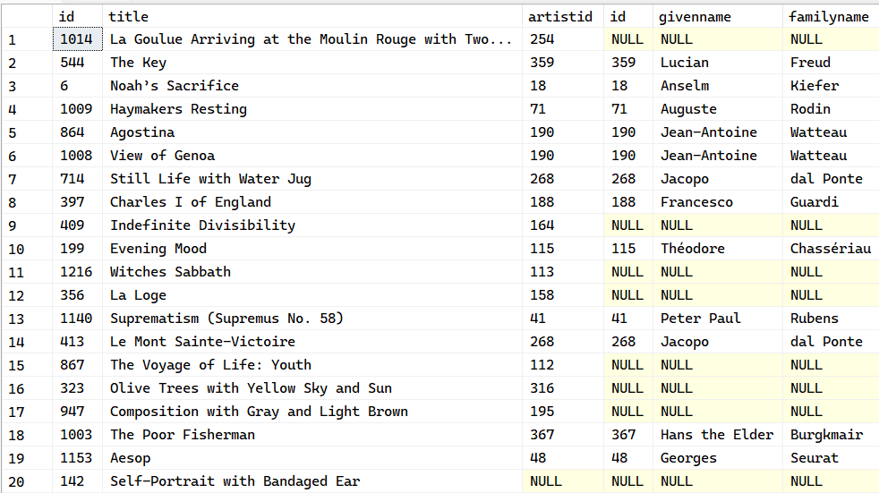

# Week 09 - Joining Tables

## I. How a Join Works

Let's revisit some recommendations for a good table design:

1. A table contains data on a [single type of object](). For example, a `paintings` table has no `artists` details
2. Multiple rows should not have the same data. For example, two paintings by the same artist should not have the artist's name.

> [!IMPORTANT]
> The correct solution is to put related data into its own table and use a **foreign key** to link one table to the **primary key**



When the time comes, the next step will be to "join" the tables into a single virtual table. To join the two tables is to "copy" one row from one table to the end of the matching row in the other table



You can then use the resulting "virtual" table to read data from both tables.
You also may have noticed a few things:

- There may be some missing rows from either table. e.g. "The Green Vineyard" painting
- Some connected rows will be duplicated
- It is not enough to specify which tables are to be joined; you also need to specify which column matches which.

The SQL query to "join" these two tables, `paintings` and `artists` is:

```
SELECT *
  FROM paintings
  JOIN artists ON paintings.artistid = artists.id;
```

or to be more concise:

```
SELECT title, artists.givenname, artists.familyname
  FROM paintings
  JOIN artists ON paintings.artistid = artists.id
```




### A. Joining the Tables

The basic join is achieved with the `JOIN ... ON` clause:

```
SELECT *
  FROM paintings
  JOIN artists ON paintings.artistid = artists.id;
```



> [!IMPORTANT]
> The join produces only a "virtual" table, it is not saved as a new table.

> [!NOTE]
> Joins can be written in different ways, from the preceding example, we wanted to list out paintings and who was credited as its artist, but it is possible to write them the other way around:
> ```
> SELECT * FROM artists JOIN paintings ON artists.id = paintings.artistid;
> ```


### B. Alternative (Original) Syntax

The `JOIN` keyword was not in the original SQL standard, and to "join" multiple tables before, you would use:

```
SELECT *
  FROM paintings, artists WHERE paintings.artistid = artists.id;
```

### C. Selecting the Results

You will probably want to select specific columns to include in the results. For example, you want to get the painting's id, title and the artist's givenname and familyname

```
-- This won't work
SELECT
  id,
  title,
  givenname, familyname
FROM paintings JOIN artists
  ON paintings.artistid = artists.id;
```



The error message you get will refer to an **ambiguous column**. In a single table, you can't have two columns with the same name, but when you join two tables and produce a "virtual table", there is always that possibility

The solution is to prefix each columns with its table name

```
SELECT
  paintings.id,
  title,
  givenname, familyname
FROM paintings JOIN artists
  ON paintings.artistid = artists.id;
```



> [!TIP]
> The notation `table.column` is referred to as a **qualified name**, and can be thought of as the full name of a column

> [!NOTE]
> The column name is still the simpler unqualified name. Even though only the ambiguous columns needs to use the qualifed name, it is still perfectly valid to "qualify" the unambiguous columns:

```
SELECT
  paintings.id,
  paintings.title,
  artists.givenname, artists.familyname
FROM paintings JOIN artists
  ON paintings.artistid = artists.id;
```

It is even **recommended** that you "qualify" all columns, because:

- You can easily see which table has the original data
- More complex joins will be easier to manage
- If someone, other than you, has decided to add a column with the same name to the linked table, you will have to qualify them anyway

### D. Table Aliases

You can simplify `JOIN` statements by using a table **alias**, which is a temporary label for a table.

To use table aliases:
- Alias the table with the `AS` keyword
- Use the alias *instead* of the original nam

```
SELECT
  p.id,
  p.title,
  a.givenname, a.familyname
FROM paintings as p JOIN artists AS a ON p.artistid = a.id;
```

---

## II. Join Types

You may have noticed that some rows may have been "missing". And we can trace the reason from paintings not having an artist, and vice versa

```
SELECT *
  FROM paintings
  WHERE artistid IS NULL;
```

> [!WARNING]
> Finding artists without paintings is bit more complex, since the FK (foreign key) is defined in the `paintings` table
> - Find the list of `artistid`s from paintings which *do* have an `artistid`
> - Find the artists whose `id` is not from the preceding result

```
SELECT * FROM artists
  WHERE id NOT IN (
    SELECT artistid FROM paintings WHERE artistid IS NOT NULL
  );
```



> [!IMPORTANT]
> When you join two tables, **only those rows in one table with a matching row in the other are included**
> Since some of the paintings have `NULL` `artistid`, SQL is unable to find a match for them in the artists table
> The unmatched paintings are left out. This is called an `INNER JOIN` and is the default

- The `INNER JOIN` returns *only* the matched rows
- The `OUTER JOIN` returns the matched rows as well as the unmatched rows. There are 3 different types
- The `CROSS JOIN` returns all possible combinations of child and parent rows

### A. The `INNER JOIN`

The default join type is the `INNER JOIN`


```
SELECT 
  p.id, p.title, p.artistid,
  a.id, a.givenname, a.familyname
FROM paintings AS p
JOIN artists AS a ON p.artistid = a.id;
```

```
SELECT 
  p.id, p.title, p.artistid,
  a.id, a.givenname, a.familyname
FROM paintings AS p
INNER JOIN artists AS a ON p.artistid = a.id;
```



> [!TIP]
> The only difference is actually just the "INNER" word. 

### B. The `LEFT OUTER JOIN` and `RIGHT OUTER JOIN`

An `OUTER JOIN` is used to include unmatched rows. It *always includes* the `INNER JOIN`

As there are two tables involved, you have a choice of whether to:

1. include the unmatched rows of the first (left) table
2. include the unmatched rows of the second (right) table

> [!IMPORTANT]
> So if you want to view all paintings and their corresponding artists (including all paintings without any artist associated to them)
> you would use an `INNER JOIN` with `paintings` as the first (left) table and `artists` as the second (right) table

```
SELECT 
  p.id, p.title, p.artistid,
  a.id, a.givenname, a.familyname
FROM paintings AS p
LEFT OUTER JOIN artists AS a ON p.artistid = a.id;
```



The result will display **all paintings and their artists (if it's available)**

And equivalent to the preceding example, and placing the `paintings` as the second (right) table:

```
SELECT 
  a.id, a.givenname, a.familyname,
  p.id, p.title, p.artistid
FROM artists AS a
RIGHT OUTER JOIN paintings AS p ON a.id = p.artistid;
```

which is virtually the same result from the previous query, only with different column ordering

> [!IMPORTANT]
> As with `INNER JOIN`, the `OUTER` keyword is also optional, so you may omit it

---

# III. Types of Binary Relationships

## A. One-to-one relationship, obligatory on both sides

e.g. Employee - Passport


Each employee must have one and only one passport; each passport must have one and only one employee. To resolve this relationship, combine both entities into one table

## B. One-to-one relationship, optional on one side 

e.g. Employee - Company Car


Each employee might have one and only one company car; each company car is owned by one and only one employee. To resolve this relationship, take the primary key from employee and post it as a foreign key in company car.

## C. One-to-one relationship, optional on both sides

e.g. Employee - Laptop


Each employee might have one laptop; each laptop might belong to one employee (but some are for general use and therefore won’t belong to anyone). To resolve this relationship, implement three tables – an employee table, a laptop table and a new table that we will call ‘owns’. The owns table only has two fields – employee number and laptop number. The primary key of owns is a ‘composite key’, i.e. it is the employee number and laptop number combined, and each combination of the two is unique.

## D. One-to-many relationship, many side obligatory to one side

e.g. Customer - Order


A customer can place many orders but might have placed no orders; each order must be placed by one and only one employee. Resolve this relationship by taking the primary key from customer and posting it as a foreign key in order.

## E. One-to-many relationship, many side optional to one side

e.g. Student - Elective


A student might take one elective module; each module is taken by many students (i.e. the students don’t have to take an elective module). The way to avoid nulls in the foreign key is to implement three tables – one for student, one for elective module and one that we’ll call ‘studies’ (as a student studies a module). The studies table has just two fields – student number and module number. The primary key of the studies table is student number (or you could implement a composite key).

## F. Many-to-many relationship

e.g. Student - Tutor


Each tutor teaches many students; each student is taught by many tutors. To resolve this relationship, implement three tables – one for student, one for tutor, and a third we’ll call ‘teaches’. The teaches table has two fields – student number and tutor number, and its primary key is a composite key, i.e. a combination of student number and tutor number.

---