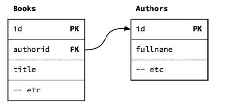
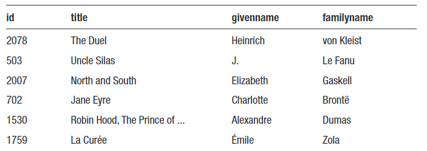
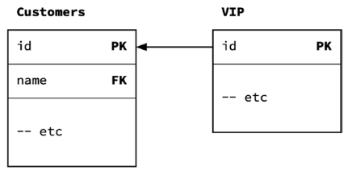
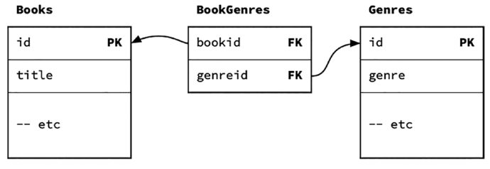

# Week 10: Table Relationships

## I. Types of Relationships

### A. One-to-many

Between a **foreign key** in one table, often called a **child** table, and a **primary key** in another table, the **parent**.
Generally, one parent can have many children.

Some examples:

- One Author has written many Books
- One Customer has many Sales
- One Sale has many Items

> [!NOTE]
>  The use of *many* can imply any number from 0 to infinity


Example for books and authors:

<details>
  <summary>One Author to Many Books</summary>

  ```
  -- PARENT TABLE (ONE)
  CREATE TABLE authors (
    id INT PRIMARY KEY,
    -- other columns
  );

  -- CHILD TABLE (MANY)
  CREATE TABLE books (
    id INT PRIMARY KEY,
    bookid INT REFERENCES authors(id),
    -- other columns
  )
  ```

  

  > [!NOTE]
  > While the child table has a reference to the parent table, the parent table does *not* have a reference back to the child table

  ```
  SELECT
    b.id, b.title,
    a.givenname, a.familyname
  FROM books AS b JOIN authors AS a ON b.authorid = a.id;
  ```

  

</details>

When you join a child table to a parent table, you generally have four options Authors to Books:

| Scenario | JOIN type | Description |
| --- | --- | --- |
| Only the matching rows | INNER JOIN | Get all Authors that have written books, do not include Authors who did not write any books |
| Include all of the umnatched parents | OUTER LEFT JOIN | Get all Authors, regardless if they have written books or not |
| Include all of the unmatched children | OUTER RIGHT JOIN | Get all Authors that have written books, and include books where the author is unknown |
| Include all of the unmatched children and parents | FULL JOIN | Get all Authors and Books, regardless if they match to the other |

### B. One-to-one

Between two **primary keys** in both tables. The primary key in one table doubles up as a foreign key in the other table.

If every row in one table is associated with a row in another table, then you can consider the second table as an extension of the first table. But why bother, if we can put all of the columns in the same table?
Some good reasons are:

- You want to add more details, but you don't want to change the original table
- You want to add more details, but you can't change the original table
- The additional table contains details that may be optional: not all rows in the original table require the additional columns
- You want to keep some of the details in a separate table so that you can add another layer of security to the additional details

> [!NOTE]
> A true one-to-one relationship requires both primary keys to be foreign keys to the other table. In practice, this is difficult to implement, and the foreign key is normally on one table only. This may informally be called a **one-to-maybe** relationship

<details>

  <summary>Customer to VIP</summary>

  ```
  CREATE TABLE customers (
    id INT PRIMARY KEY,
    -- other columns
  );

  CREATE TABLE vip (
    id INT PRIMARY KEY REFERENCES customers(id),
    -- additional columns
  );
  ```

  

  > [!NOTE]
  > This relationship is implemented by making the `id` in the secondary table (vip) both a primary key and a foreign key

  ```
  SELECT c.*, v.*
  FROM customers AS c LEFT JOIN vip AS v ON c.id = v.id
  ```

  > [!IMPORTANT]
  > We need the LEFT (OUTER) JOIN to include non-VIP customers. If you wanted VIP customers only, a simple (inner) JOIN would be better

</details>

### C. Many-to-many

Allow a row in one table to relate to many rows in the other table, and vice-versa. Since columns can only have single valuies, this relationship is created through another table, often called an **associative** table, with a pair of one-to-one relationships

To represent a many-to-many relationship between tables, you will need another table which **links** the two others:



```
CREATE TABLE books (
  id INT PRIMARY KEY,
  title VARCHAR,
  -- other columns
);

CREATE TABLE genres (
  id INT PRIMARY KEY,
  name VARCHAR,
  description VARCHAR,
  -- other columns
);

-- ASSOCIATIVE TABLE
CREATE TABLE book_genres (
  bookid INT REFERENCES books(id),
  genreid INT REFERENCES genres(id),
  PRIMARY KEY (bookid, genreid)
);
```

To join `books` and `genres` via `book_genres`, you will need an `INNER JOIN`

```
SELECT *
  FROM book_genres AS bg
  JOIN books AS b ON bg.bookid = b.id
  JOIN genres AS g ON bg.genreid = g.id
;
```

---